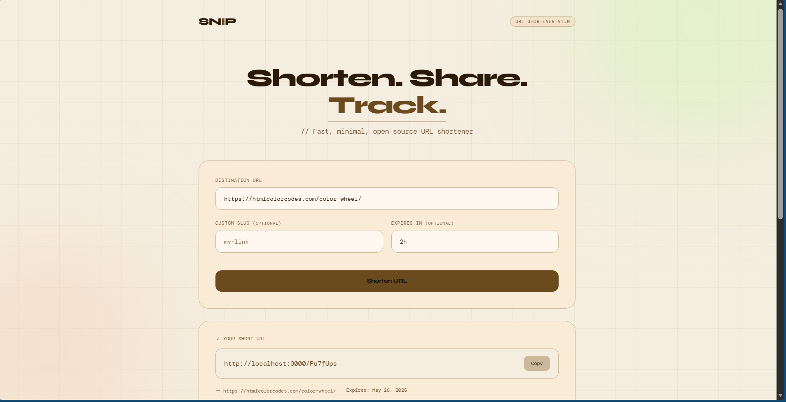
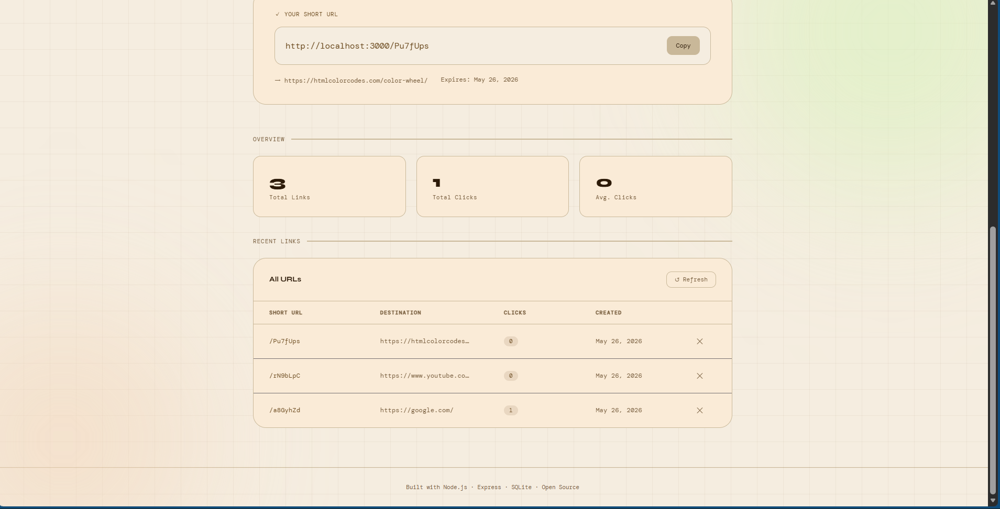
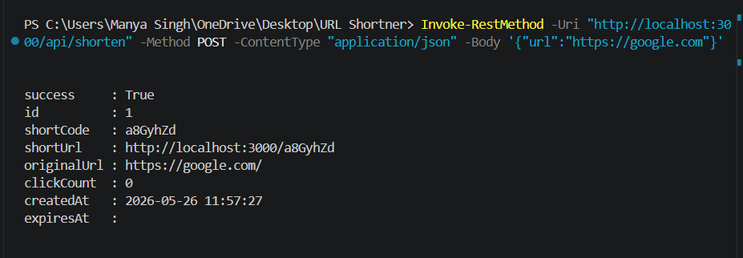
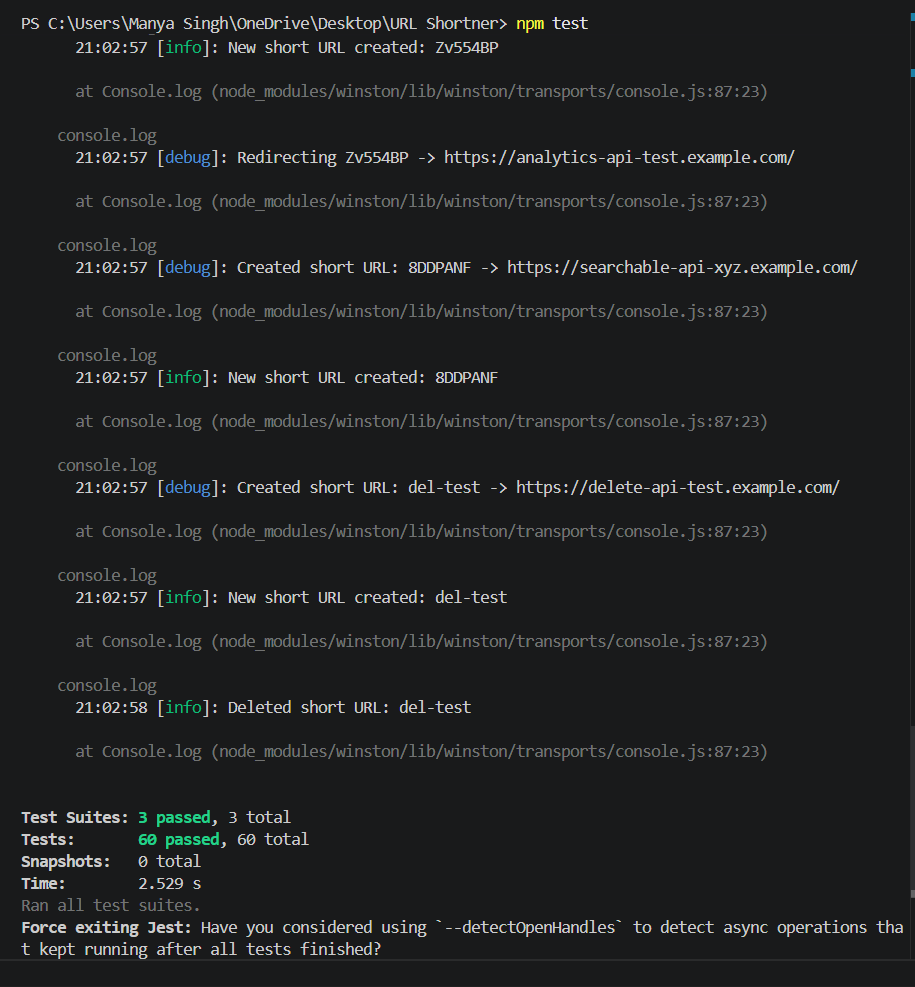

<div align="center">

# SNIP – URL Shortening & Link Analytics Platform

Production-grade URL shortening platform featuring **custom slugs**, **link analytics**, **link expiration**, **rate limiting**, **duplicate detection**, and **SSRF protection**.

Built with **Node.js + Express + SQLite**, focused on scalable URL management, secure API design, and high-performance link redirection.


</div>

---

## Features

- **URL Shortening** — Generate 7-character nano IDs from a URL-safe alphabet
- **Custom Slugs** — Choose your own short path (e.g. `/my-launch`)
- **Link Expiry** — Set TTL with human-readable durations (`7d`, `24h`, `30m`)
- **Click Analytics** — Track clicks, referrers, and daily breakdown per link
- **Deduplication** — Returns the existing short code for a repeated URL
- **Rate Limiting** — Per-IP limits on creation (50/hr) and general API (100/15min)
- **SSRF Protection** — Blocks localhost, `127.x.x.x`, and private IP ranges
- **Soft Delete** — Deactivates links without destroying analytics history
- **Graceful Shutdown** — Handles `SIGTERM`/`SIGINT` cleanly (container-ready)
- **Structured Logging** — Winston with daily log rotation
- **Full Test Suite** — Unit + integration tests via Jest & Supertest

---

## Screenshots










## Tech Stack

| Layer        | Technology                |
|-------------|---------------------------|
| Runtime      | Node.js 18+               |
| Framework    | Express 4                 |
| Database     | SQLite via better-sqlite3 |
| ID Gen       | nanoid (custom alphabet)  |
| Hashing      | Node.js crypto (SHA-256)  |
| Validation   | express-validator         |
| Rate Limit   | express-rate-limit        |
| Security     | helmet, cors              |
| Logging      | winston, morgan           |
| Testing      | Jest, Supertest           |

---

## Project Structure

```
url-shortener/
├── src/
│   ├── app.js                  # Express app setup
│   ├── server.js               # Entry point + graceful shutdown
│   ├── config/
│   │   └── database.js         # SQLite init + singleton
│   ├── controllers/
│   │   └── url.controller.js   # Business logic
│   ├── middleware/
│   │   ├── validators.js       # express-validator rules
│   │   ├── rateLimiter.js      # Rate limit configs
│   │   └── errorHandler.js     # 404 + global error handler
│   ├── models/
│   │   └── url.model.js        # All DB queries
│   ├── routes/
│   │   ├── api.routes.js       # /api/* routes
│   │   └── redirect.routes.js  # /:code redirect
│   └── utils/
│       ├── hash.js             # nanoid, SHA-256, URL validation
│       └── logger.js           # Winston logger
├── public/
│   └── index.html              # Frontend UI (vanilla JS)
├── tests/
│   ├── api.test.js             # Integration tests (Supertest)
│   ├── url.model.test.js       # Unit tests (Model layer)
│   └── hash.test.js            # Unit tests (Utilities)
├── data/                       # SQLite DB lives here (git-ignored)
├── logs/                       # Log files (git-ignored)
├── .env.example
├── .gitignore
└── package.json
```

---

## Getting Started

### Prerequisites

- Node.js 18 or higher
- npm 9+

### Installation

```bash
# 1. Clone the repo
git clone https://github.com/YOUR_USERNAME/url-shortener.git
cd url-shortener

# 2. Install dependencies
npm install

# 3. Set up environment variables
cp .env.example .env
# Edit .env as needed

# 4. Start the development server
npm run dev
```

Open [http://localhost:3000](http://localhost:3000) in your browser.

---

## Environment Variables

| Variable                  | Default                  | Description                              |
|--------------------------|--------------------------|------------------------------------------|
| `PORT`                   | `3000`                   | Server port                              |
| `NODE_ENV`               | `development`            | Environment (`development`/`production`) |
| `BASE_URL`               | `http://localhost:3000`  | Public base URL for short links          |
| `DB_PATH`                | `./data/urls.db`         | Path to SQLite database file             |
| `SHORT_CODE_LENGTH`      | `7`                      | Length of generated short codes          |
| `RATE_LIMIT_WINDOW_MS`   | `900000`                 | Rate limit window in ms (15 min)         |
| `RATE_LIMIT_MAX_REQUESTS`| `100`                    | Max API requests per window              |
| `ENABLE_ANALYTICS`       | `true`                   | Record click analytics                   |

---

## API Reference

### `POST /api/shorten`

Create a short URL.

**Request Body:**
```json
{
  "url": "https://example.com/very/long/url",
  "customSlug": "my-link",      // optional: 3-32 chars, [a-zA-Z0-9_-]
  "expiresIn": "7d"             // optional: 30m | 24h | 7d | 2w
}
```

**Response `201`:**
```json
{
  "success": true,
  "shortCode": "aB3xY9k",
  "shortUrl": "http://localhost:3000/aB3xY9k",
  "originalUrl": "https://example.com/very/long/url",
  "clickCount": 0,
  "createdAt": "2024-01-15 10:30:00",
  "expiresAt": "2024-01-22 10:30:00"
}
```

---

### `GET /:code`

Redirect to the original URL (`301 Moved Permanently`).

---

### `GET /api/urls/:code`

Get info for a short URL.

---

### `GET /api/urls/:code/analytics`

Get click analytics for a short URL.

**Response:**
```json
{
  "success": true,
  "data": {
    "totalClicks": 42,
    "clicksByDay": [
      { "date": "2024-01-15", "clicks": 18 }
    ],
    "topReferrers": [
      { "referrer": "https://twitter.com", "count": 12 }
    ]
  }
}
```

---

### `GET /api/urls?page=1&limit=20&search=`

List all URLs (paginated, with optional search).

---

### `DELETE /api/urls/:code`

Soft-delete a short URL (preserves analytics).

---

### `GET /api/stats`

Overall statistics: total links, total clicks, top URLs.

---

### `GET /health`

Health check for uptime monitoring.

```json
{ "status": "ok", "uptime": 123.4, "timestamp": "..." }
```

---

## Running Tests

```bash
# Run all tests
npm test

# Run with coverage report
npm run test:coverage
```

The test suite uses an **in-memory SQLite database** so no setup is required and tests run in isolation.

---

## Key Design Decisions

### Hashing Strategy
Short codes are generated using **nanoid** with a custom 55-character URL-safe alphabet that excludes visually ambiguous characters (`0`, `O`, `1`, `l`, `I`). For programmatic use, a deterministic SHA-256 hash option is also available in `utils/hash.js`.

### Collision Handling
On code generation, the model checks for collisions and retries up to 5 times, falling back to a 10-character code. At 7 characters with a 55-char alphabet, the probability of collision across 1M links is negligible (~0.01%).

### WAL Mode
SQLite is configured with `PRAGMA journal_mode = WAL` for better concurrent read performance, which matters when redirects and writes happen simultaneously.

### Soft Delete
URLs are deactivated (`is_active = 0`) rather than hard-deleted to preserve analytics history and avoid breaking bookmarked links unexpectedly.

---

## License

MIT © Manya Singh
